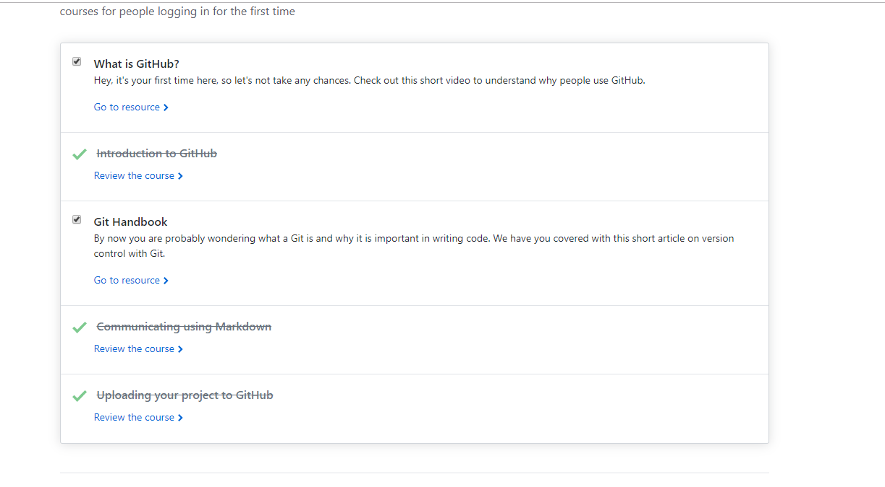
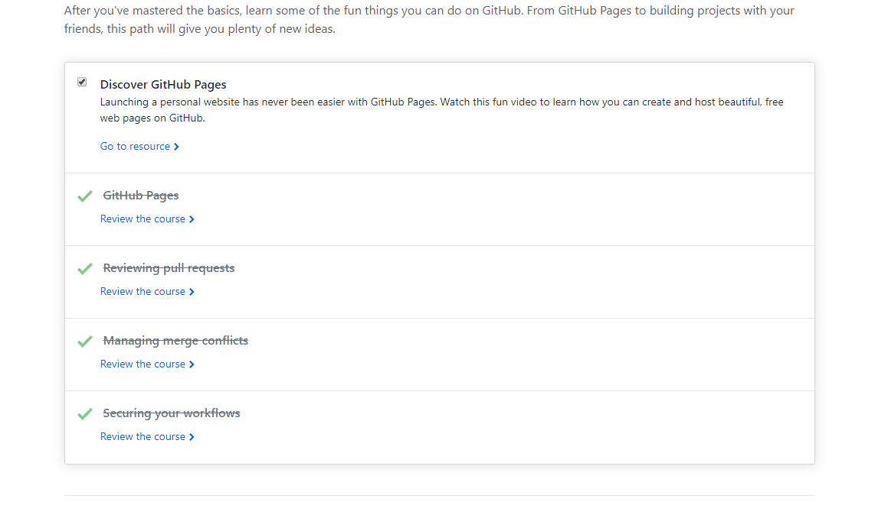
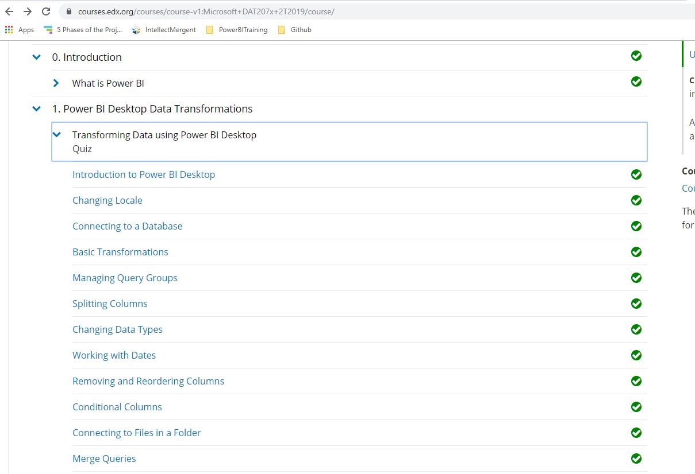
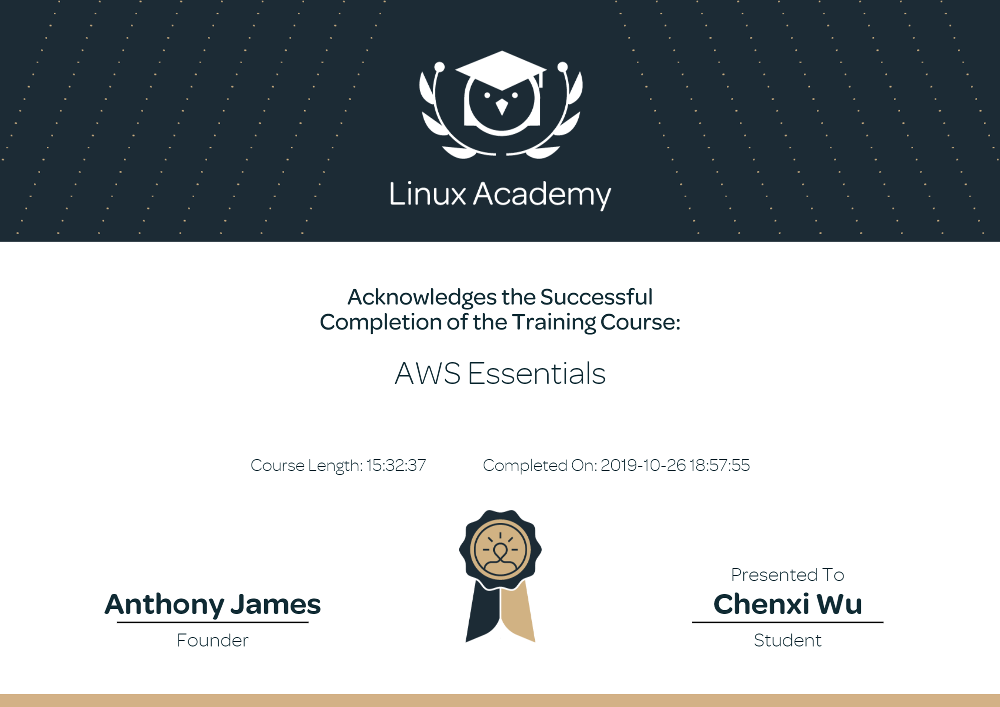

<h1>Chenxi Wu Technical Skills and Certifications</h1>

 

 

Listed below are the technical skills I acquired as a MBA Candidate at The University of Tulsa.

<h2>Technical Skills</h2>

GitHub Learning Lab

 
I completed the following courses in the <a href="https://lab.github.com/courses">GitHub Learning Lab</a>. These courses taught me how to stand up static pages, create and manage pull requests, facilitate collaboration, and more. 
 
  
<h4>Courses:</h4>
<ul>
<li>Introduction to GitHub</li>
<li>Communicating using Markdown</li>
<li>Introduction to HTML</li>
<li>GitHub Pages</li>
<li>Managing merge conflicts</li>
<li>Community Starter Kit</li>
<li>Uploading your project to GitHub</li>
<li>Getting started with GitHub Apps</li>
<li>Migrating your repository to GitHub</li>
<li>Reviewing pull requests</li>
<li>Securing your workflows</li>
<li>Create a release based workflow</li>
</ul>
 
 

 
 

 

Power BI

 
 I auditted the <a href="https://www.edx.org/course/analyzing-and-visualizing-data-with-power-bi-0">Analyzing and Visualizing Data with Power BI</a> course on edX and completed the following courses. These courses taught me how to input data, add and modify elements on a dashboard, and transform and interpret different kinds of data. 
 
  
<h4>Courses:</h4> 
<ul>
<li>Power BI Desktop Data Transformations</li>
<li>Power BI Desktop Modelling</li>
<li>Power BI Desktop Visualization</li>
<li>Power BI Service</li>
<li>Working with Excel</li>
<li>Direct Connectivity</li>
<li>Developer API</li>
<li>Mobile App</li>
<h4> Course Completion: </h4>

</ul>

Power BI Dashboard

<li>The first stumbling point I encountered during this training was in Section 2: Power BI Desktop Modeling. It is not apparent at the time you are during it but setting up all the relationships between the tables in the dataset is imperative as it will impact the answers you generate to complete the lab.</li>

<li>Section 3: Power BI Desktop Visualization is the first time you begin to create reports and dashboards. I found it extremely helpful in this section to recreate the visuals you are quizzed on. The datasets for this are given to you in the prior section.</li>

<li>Section 4: Working with the Power BI Service provides a very important discussion on how to edit the settings of certain features within your Microsoft Tenant. You are able to turn off the ability to export data to excel, create webpages, etc.</li>

<li>In Section 5: Working with Excel, you may get an error when trying to complete the lab if you are not using Internet Explorer. In order to complete the lab you will need Silverlight installed in IE.</li>

<li>Section 6: Organization Packs, Security and Groups has not kept up with Microsoft’s constantly changing application suite. The directions for the lab are no longer actuate, but the lab can still be completed. You can no longer create a group as per the directions, but you can use the app workspace to essential achieve the same goal. Here is a good resource for more information.</li>

<li>Click below for a video recording of the final dashboard</li>

<a href="https://www.youtube.com/watch?v=qSPVreD3jZo">SupplierQualityAnalysisVideo</a>
 

VPN

 
I configured my own IPSEC VPN in the cloud using the <a href="https://github.com/trailofbits/algo">Algo VPN</a> Ansible scripts provided by Trail of Bits. With the help of this tutorial, I successfully deployed the Algo server, configured the VPN clients, set up an SSH tunnel, and added and removed users. 
 
 

Amazon Web Services (AWS)

 
  I completed the AWS Essentials - NEW course on <a href="https://linuxacademy.com/">Linux Academy</a>. These courses provided me with an introduction to Amazon's Identity Access Management, Elastic Compute Cloud, database services, Simple Notification System, Elastic Load Balancers, Auto Scaling, and Route 53. 
 
 

<h4>Topics:</h4>
<ul>
  <li>AWS Essentials</li>
  <li>Managing AWS Access with Users, Groups, and Roles</li>
  <li>Identity and Access Management (IAM)</li>
  <li>Networking Services and Connectivity</li>
  <li>Virtual Private Cloud (VPC)</li>
  <li>Compute Services</li>
  <li>Elastic Cloud Compute (EC2)</li>
  <li>Storage Services</li>
  <li>Database Services</li>
  <li>Monitoring, Alerts, and Notifications</li>
  <li>Simple Notification Service (SNS)</li>
  <li>Load Balancing, Elasticity, and Scalability</li>
  <li>Elastic Load Balancer (ELB)</li>
  <li>Auto Scaling</li>
  <li>Route 53</li>
  <li>Serverless Computing - Lambda</li>
  
</ul>
 

Linux

   

<h4>Topics:</h4>
<ul>
<li>The Linux Community and a Career in Open Source</li>
<li>Linux Evolution and Popular Operating Systems</li>
<li>How to Access a Linux Installation</li>
<li>Major Open Source Applications</li>  
<li>Understanding Open Source Software and Licensing</li> 
<li>ICT Skills and Working in Linux</li>
<li>Command Line Basics</li> 
<li>Using Directories and Listing Files</li> 
<li>Archiving Files on the Command Line</li> 
<li>Searching and Extracting Data from Files</li> 
<li>Turning Commands into a Script</li>
<li>The Linux Operating System</li>
<li>Security and File Permissions</li>
<li>Basic Security and Identifying User Groups</li>
<li>Creating Users and Groups</li> 
<li>Managing File Permissions and Ownership</li> 
<li>Special Directories and Files</li> 
<h4> Course Completion: </h4>

</ul>

Powershell

<li>Completing the PowerShell 5 Essential Training through LinkedIn Learning helped expose me to the basics of utilizing cmdlets as an administrator to access and automate features of my Windows operating system. It emphasizes the importance of the "get-help" command in order to find useful assistance with syntax, module installation, csv and xml file imports and exports, script writing in ISE instead of in Notepad, etc. I also appreciated how the course covered how to set execution policies on the security side of things as well as an overview of variable and array creation. Courses completed include:</li>
<li>Installing Windows Management Framework 5</li>
<li>Running commands (cmdlets)</li>  
<li>Discovering commands</li> 
<li>Understanding cmdlet syntax</li>
<li>Resolving terse commands</li>
<li>Finding and using local modules</li>  
<li>Working with files, printers, CSVs, and XML in the pipeline</li> 
<li>Selecting, sorting, and filtering object data</li>
<li>Creating scripts</li>
<li>Automating tasks</li>  
<li>Using PowerShell remoting</li> 

